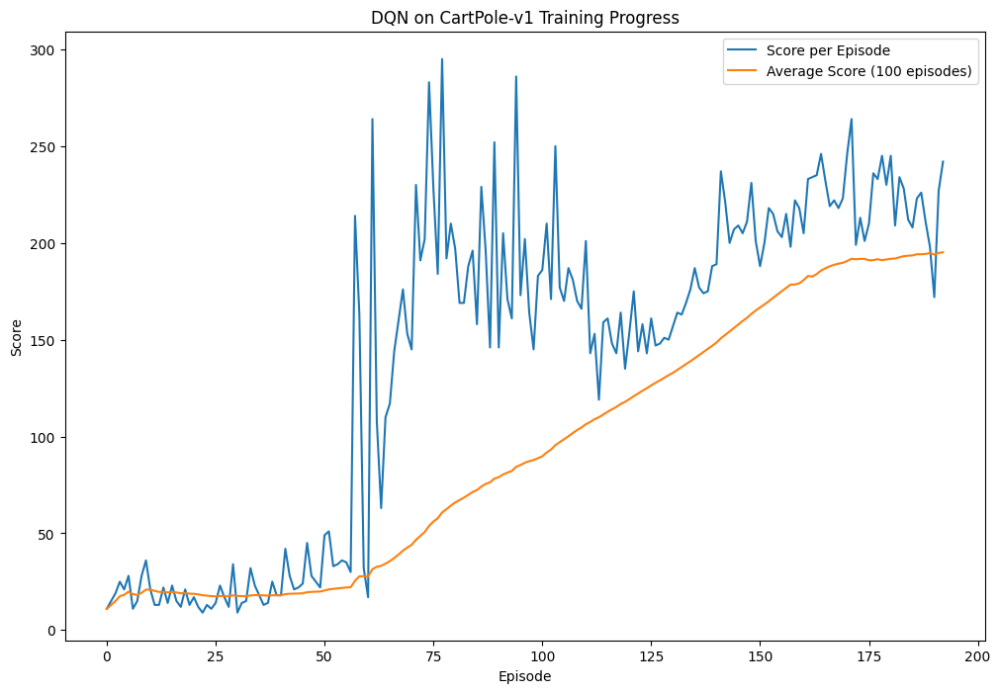

# Deep Q-Network (DQN) on CartPole

## Project Overview
This project implements a **Deep Q-Network (DQN)** reinforcement learning algorithm to solve the CartPole-v1 environment from OpenAI Gym. In this environment, a pole is attached to a cart moving on a frictionless track. The goal is to prevent the pole from falling over by controlling the cart's movement (left or right). The agent receives a reward of +1 for each timestep the pole remains upright, and the episode ends when the pole is more than 15 degrees from vertical or the cart moves outside the display boundaries.

**NOTE:** The implementation and training process are documented in the Jupyter Notebook located at
`notebooks/DQN_CartPole.ipynb`

## Mathematical Background
The DQN algorithm combines Q-learning with deep neural networks to approximate the action-value function. It addresses the instability issues of using neural networks in reinforcement learning through:

- **Experience Replay**: Storing and randomly sampling transitions to break correlations in the observation sequence
- **Target Network**: Using a separate network for generating target values to stabilize training

The update rule follows the Bellman equation:
```math
Q(s,a) \leftarrow Q(s,a) + \alpha \left[ r + \gamma \cdot \max_{a'} Q(s',a') - Q(s,a) \right]
```

## Model Architecture
The DQN implementation uses a neural network with the following architecture:

- **Input Layer**: State vector (4 dimensions for CartPole)
- **Hidden Layers**: Two fully-connected layers with 128 neurons each and ReLU activation
- **Output Layer**: Action values (2 outputs for CartPole representing left and right movements)

The agent maintains two identical networks:
1. **Policy Network**: Actively updated to learn the Q-function
2. **Target Network**: Periodically updated from the policy network to provide stable learning targets

## Training Process

### Hyperparameters
- Discount factor (γ): 0.95
- Initial exploration rate (ε): 1.0
- Minimum exploration rate: 0.01
- Exploration decay rate: 0.995
- Learning rate: 0.001
- Batch size: 64
- Replay memory capacity: 2000 transitions
- Target network update frequency: Every 10 episodes

### Training Loop
1. The agent interacts with the environment using an ε-greedy policy
2. Experiences (state, action, reward, next state, done) are stored in the replay buffer
3. Random minibatches of experiences are sampled to update the policy network
4. Target network is periodically updated to match the policy network
5. Training continues until the agent achieves an average score of 195+ over 100 consecutive episodes

## Results
The DQN agent successfully solves the CartPole-v1 environment, learning to balance the pole for extended periods. Training progress shows:

- Initial random policy yielding low scores (<50)
- Rapid improvement as the agent learns effective control strategies
- Convergence to near-maximum scores (200) as training progresses
- Gradually decreasing exploration rate as the agent becomes more confident

### Training Visualization

The training progress plot demonstrates the agent's learning curve, showing initial instability followed by steady improvement and eventual convergence to high performance.



## Key Takeaways
- DQN solves CartPole through trial-and-error learning.
- The target network stabilizes Q-value estimates.
- Experience replay improves sample efficiency.
- ε-greedy policy balances exploration and exploitation.

## References
- [CartPole-v1 Environment](https://www.gymlibrary.dev/environments/classic_control/cart_pole/)
- Mnih, V., Kavukcuoglu, K., Silver, D., et al. (2015). [Human-level control through deep reinforcement learning](https://www.nature.com/articles/nature14236).
